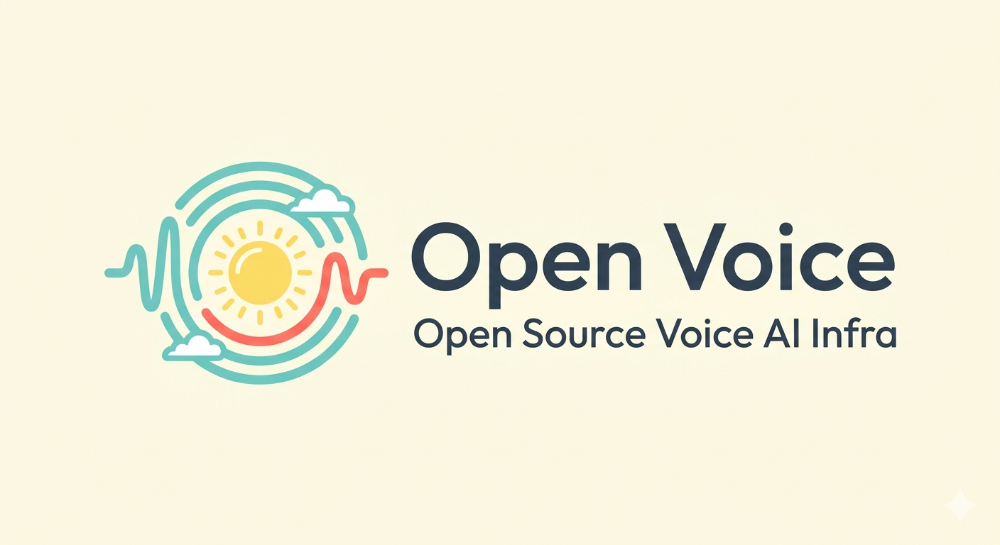

# Open Voice

> 🚧 Work in progress 🚧

End-to-end open-source voice AI infrastructure - real-time WebRTC pipeline for streaming, context, tool calls, and speech. Includes web & mobile clients.

## Acknowledgements

- Silero VAD: https://github.com/snakers4/silero-vad
- aiortc: https://github.com/aiortc/aiortc
- Modal: https://modal.com/docs/examples/webrtc_yolo